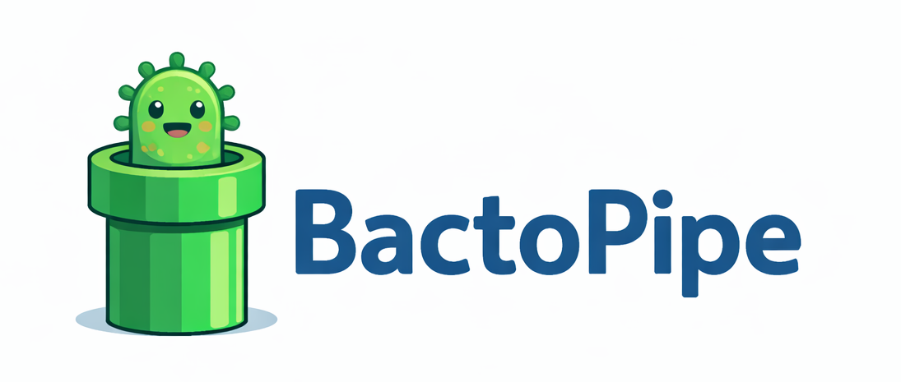

<p align="center">
  
</p>

# BactoPipe – pipeline do składania genomów bakteryjnych z danych ONT

BactoPipe to modularny pipeline oparty na Snakemake, przeznaczony do analizy danych z sekwencjonowania całogenomowego (WGS) bakterii generowanych technologią Oxford Nanopore Technologies (ONT).

Pipeline realizuje pełen standardowy workflow:
kontrola jakości odczytów, filtrowanie, składanie genomu oraz polerowanie,
w sposób **powtarzalny, konfigurowalny i przystosowany do uruchamiania na serwerach obliczeniowych**.

Pipeline korzysta z **kontenerów Apptainer/Singularity**

---

## Co robi pipeline

Workflow składa się z następujących etapów:

1. **Kontrola jakości surowych odczytów**
   - statystyki długości i jakości odczytów przy użyciu **NanoPlot**
   - generowany raport HTML

2. **Filtrowanie odczytów**
   - zastosowanie progów filtrowania: długość odczytu > 1000 pz oraz średnia jakość > Q10

3. **Kontrola jakości po filtracji**
   - raport NanoPlot dla przefiltrowanych odczytów

4. **Składanie genomu**
   - składanie de novo genomu bakteryjnego przy użyciu **Autocycler**

5. **Polerowanie złożenia**
   - końcowe polerowanie przy użyciu **Medaka**

Całość jest zarządzana przez **Snakemake**, co umożliwia łatwe wznawianie,
kontrolę zależności oraz równoległe wykonywanie zadań.

---

## Struktura repozytorium
```bash
BactoPipe/
├── BactoPipe.png              # logo
├── Snakefile                  # główny plik pipeline’u (Snakemake)
├── README.md                  # dokumentacja
├── config/
│   └── config.yaml            # konfiguracja pipeline’u 
├── rules/
│   ├── qc_nanoplot.smk        # kontrola jakości surowych odczytów 
│   ├── qc_nanofilt.smk        # filtrowanie odczytów
│   ├── qc_nanofilt_filtered.smk  # QC po filtracji
│   ├── assembly.smk           # składanie genomu
│   └── polishing.smk          # polerowanie złożenia
```
## Dane wejściowe
Pipeline oczekuje bakteryjnych danych WGS ONT w formacie:

- .fastq
- .fastq.gz
- .fq
- .fq.gz

## Kontenery
Pipeline jest przystosowany do uruchamiania na serwerze obliczeniowym, z wykorzystaniem kontenerów Apptainer/Singularity.

Wszystkie obrazy kontenerów (.sif) powinny być wcześniej pobrane i znajdować się w jednym, wspólnym katalogu, np.:
```bash
/shared/singularity_images/
```
Ścieżki do poszczególnych obrazów kontenerów są definiowane w pliku:
```bash
config/config.yaml
```
Pipeline nie pobiera kontenerów automatycznie w trakcie działania – zakłada dostęp do lokalnego repozytorium obrazów na serwerze.

## Uruchamianie pipeline’u

**1. Klonowanie repozytorium**

```bash
git clone https://github.com/psrednicka/BactoPipe.git
cd BactoPipe
```
**2. Aktywacja środowiska Snakemake**
```bash
conda create -n snakemake -c conda-forge -c bioconda snakemake
conda activate snakemake
```
**3. Test (dry-run)**
Zalecane przed pierwszym uruchomieniem:
```bash
snakemake -n \
  --use-singularity \
  --singularity-args "--bind /shared" \
  -j 4 \
  --config input=/ŚCIEŻKA/DO/FASTQ \
  output=/ŚCIEŻKA/DO/WYNIKÓW
```
**4. Uruchomienie właściwe**
```bash
snakemake \
  --use-singularity \
  --singularity-args "--bind /shared" \
  -j 4 \
  --config input=/ŚCIEŻKA/DO/FASTQ output=/ŚCIEŻKA/DO/WYNIKÓW
  ```
**Parametry**

- input – katalog z plikami FASTQ (wymagany)

- output – katalog wynikowy (wymagany)

- -j – liczba równoległych zadań (dostosować do zasobów klastra)

## Struktura wyników

Dla każdej próbki (PRÓBKA) tworzona jest struktura wyników:
```bash
results
`-- PRÓBKA
    |-- assembly
    |   |-- autocycler_work
    |   |   |-- assemblies
    |   |   |-- autocycler_out
    |   |   `-- subsampled_reads
    |   |-- consensus_assembly.fasta
    |   |-- consensus_assembly.fasta.fai
    |   `-- consensus_assembly.fasta.map-ont.mmi
    |-- filtered
    |   `--PRÓBKA.filtered.fastq.gz
    |-- polishing
    |   `-- medaka
    |       |-- calls_to_draft.bam
    |       |-- calls_to_draft.bam.bai
    |       |-- consensus.fasta
    |       |-- consensus.fasta.gaps_in_draft_coords.bed
    |       `-- consensus_probs.hdf
    `-- qc
        |-- nanoplot
        |   |-- LengthvsQualityScatterPlot_dot.html
        |   |-- LengthvsQualityScatterPlot_kde.html
        |   |-- NanoPlot_20260111_1801.log
        |   |-- NanoPlot_20260111_1806.log
        |   |-- NanoPlot-report.html
        |   |-- NanoStats.txt
        |   |-- Non_weightedHistogramReadlength.html
        |   |-- Non_weightedLogTransformed_HistogramReadlength.html
        |   |-- WeightedHistogramReadlength.html
        |   |-- WeightedLogTransformed_HistogramReadlength.html
        |   `-- Yield_By_Length.html
        `-- nanoplot_filtered
            |-- LengthvsQualityScatterPlot_dot.html
            |-- LengthvsQualityScatterPlot_kde.html
            |-- NanoPlot_20260115_1536.log
            |-- NanoPlot-report.html
            |-- NanoStats.txt
            |-- Non_weightedHistogramReadlength.html
            |-- Non_weightedLogTransformed_HistogramReadlength.html
            |-- WeightedHistogramReadlength.html
            |-- WeightedLogTransformed_HistogramReadlength.html
            `-- Yield_By_Length.html
```
## Status projektu
Pipeline BactoPipe jest rozwijany na bieżąco i powstał w ramach działalności Międzyzakładowej Grupy Problemowej ds. Bioinformatyki w IBPRS-PIB.